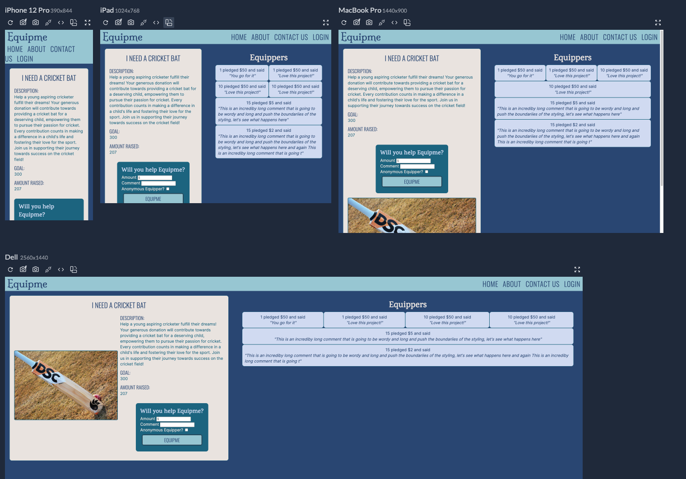

# Crowdfunding Project (Front end with React JS)

[View live site here](https://main--capable-pie-c83a54.netlify.app/)

EquipMe is a crowdfundinng platform focused on connecting donors willing to provide financial support with individuals in need of sporting equipment.

## Project Plan
A list of items that were planned & implemeneted outside of structured lessons, with some items remaining for future development

[Project Plan To Do List](./todo.md)

## Screenshots

### Responsive Homepage

### Project Creation Form

### Responsive project page, with pledges

